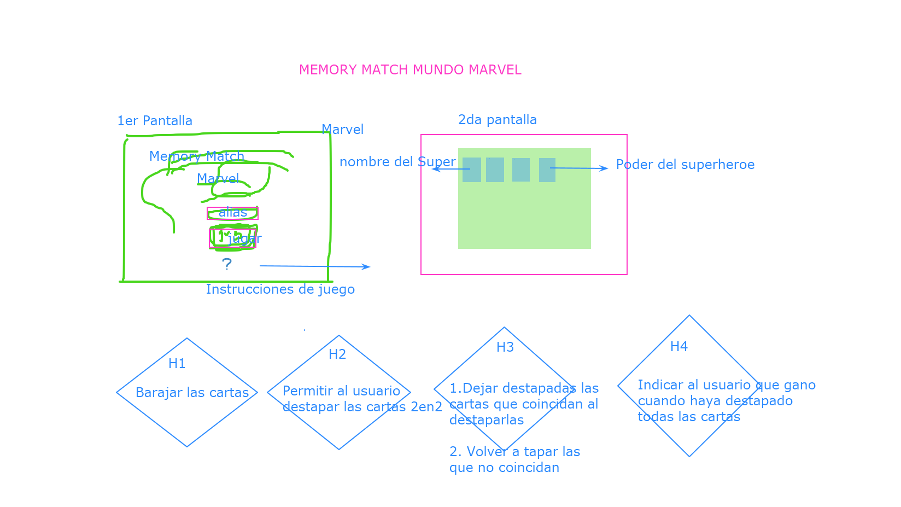
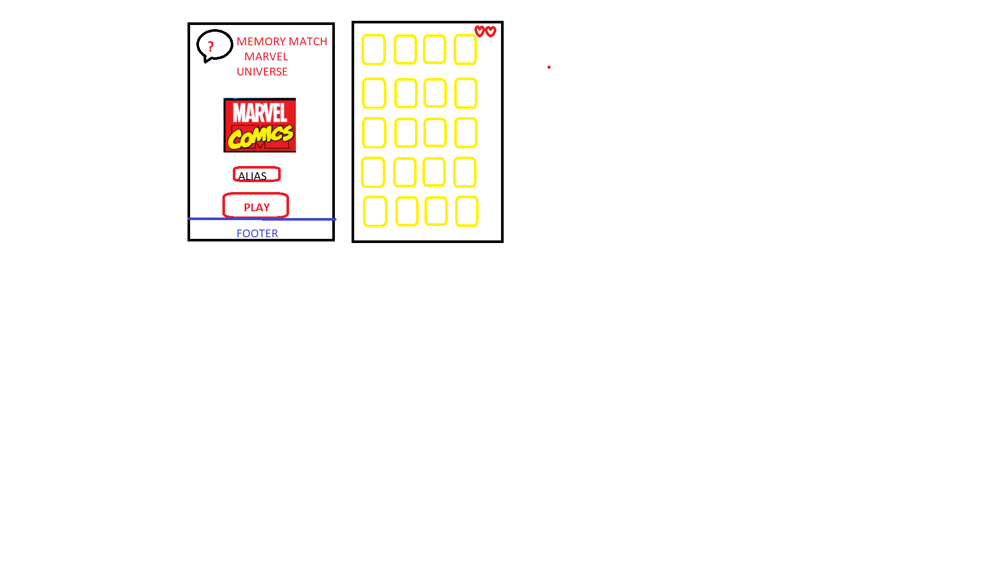
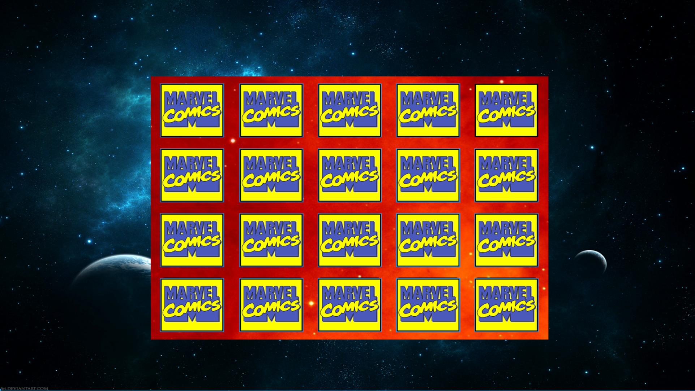
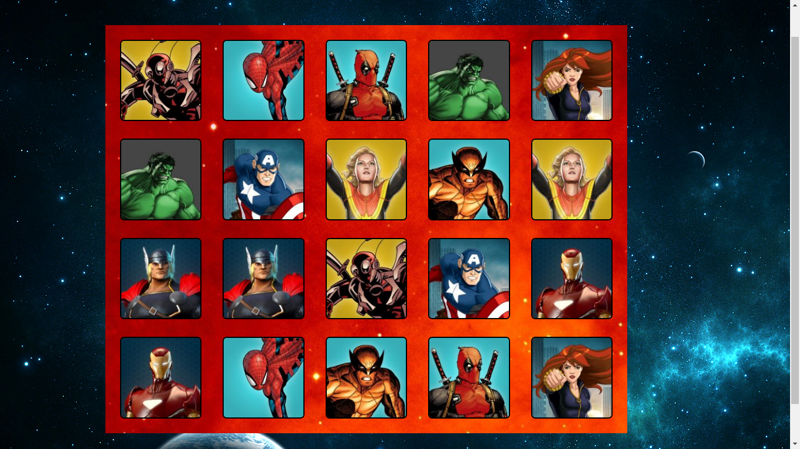

# Memory Match Game

## Índice

* [1. Investigación UX](##1-InvestigaciónUX)
* [2. Historias de Usuario](##2-HistoriasdeUsuario)
* [3. Prototipos](##3-Prototipos)
* [4. Test de usabilidad](##4-Testdeusabilidad)

***

# Memory Match Marvel Universe

Nuestro proyecto es un juego de memoria con temática de Marvel Universe, en donde el usuari@ identifica el superhéroe y debe buscar la tarjeta idéntica para que haga match, el usuario cuenta con 10 vidas para realizarlo si logra terminarlo se le mostrará un mensaje ganador, de lo contrario un mensaje perdedor, adicionalmente se le da la opción de volver a jugar o salir del juego.

## 1-Investigación UX:
¿Quiénes son los principales usuarios de producto?
Nuestros principales usuarios son los geek de Marvel.

¿Cuáles son los objetivos de estos usuarios en relación con el producto?
* Conocer los superhéroes ocultos en el juego
* Satisfacer los gustos con la temática.
* Realizar el juego utilizando la menor cantidad de vidas, con el fin de probar la capacidad de concentración del jugador.

¿Cuáles son los componentes principales de la interfaz y por qué?
El usuario puede ver una pantalla principal en donde podrá colocar su alias o nickname, adicionalmente encontrara la opción de ver las instrucciones en forma de (?), y otro botón para dar PLAY al juego e ingresar a la segunda pantalla.

En la segunda pantalla el usuario podra ver su alias junto a las 10 vidas que le ofrece el juego, seguido se le mostrará la ubicación de las tarjetas por 3seg y ya esta listo para comenzar a jugar.

¿Cuándo utilizan o utilizarían el producto?
Cuando el usuario quiera distraerse o quiera afianzar su memoria con un juego de habilidad mental.

## 2-Historias de Usuario
Historia de Usuiario 1 Pantalla Principal.
Descripción: YO como usuario geek de Marvel QUIERO  ingresar al juego con mi nickname PARA reconocerme y poder jugar.

Criterios de Aceptación:
* El usuario podra ingresar su alias
* Puede conocer las instrucciones del juego
* Encontrará un boton para dar Play al juego

Historia de Usuiario 2 Barajar y mostrar set de tarjetas.
Descripción: YO como usuario geek de marvel QUIERO ver un pantalla del set de tarjetas PARA que al dar click en cada tarjeta me muestre su contenido

Criterios de Aceptación:.
* Ver las 20 cartas distribuidas en la segunda pantalla
* Que el juego se muestre barajado
* Al iniciar el juego me muestre el back de las tarjetas
* Cuando de click sobre la tarjeta debe mostrar el superhéroe oculto

Historia de Usuiario 3 Hacer match y ver vidas.
Descripción: YO como jugador Memory Match Marvel Universe  QUIERO destapar las cartas en pares PARA hacer match o no match si me equivoco

Criterios de Aceptación:
* Mostrar por unos segundos los superhéroes al inciar la segunda pantalla para dar una pista al usuario (hacker edition)
* Ver en la parte superior de la pantalla las vidas disponibles (hacker edition)
* Destapar las tarjetas de a 2 en 2
* Si las cartas coinciden hace match y me las deja destapadas; de lo contrario se vuelvan a esconder.

Historia de Usuiario 4 Volver a jugar o Salir.
Criterios de Aceptación:
* Al hacer el último match debe aparecer una pantalla pequeña en donde muestre un mensaje informando si gano o perdio.
* En esta pantalla encontrará dos botones en donde nos de la opción de volver a jugar o salir del juego.

Definición de terminado: 
* Test unitarios.
* Hacer comparación con los protipos de UD y HD.
* Hacer despliegue en gitHub pages.
* Ser Responsive para desktop, tablets y celulares.

## 3-Prototipos 
Prototipos LD

Prototipo Celular

Prototipos HD

## 4-Test de usabilidad

Se aplicaron los test de usabilidad un grupo de 10 personas, prácticamente cuando el juego ya cumplía con su funcionalidad principal de Memory Game. Luego de terminar el juego se obtuvieron los siguientes hallazgos.

1. Los colores usados en el juego corresponden a la temática de Marvel.
2. El número de vidas insertado en el juego fue suficiente para permitir al jugador ganar en algunas ocasiones.
3. Se requiere de cierto nivel de concentración para realizar todos los matchs y poder ganar.
4. Pocos usuarios acudieron a las instrucciones antes de empezar el juego.
5. La mayoría de usuarios lograron ingresar su ALIAS y jugar el juego al menos dos veces sin problema.
6. Se encontró un error en el juego, el usuario al hacer doble click en la misma tarjeta lo toma como un match. 

